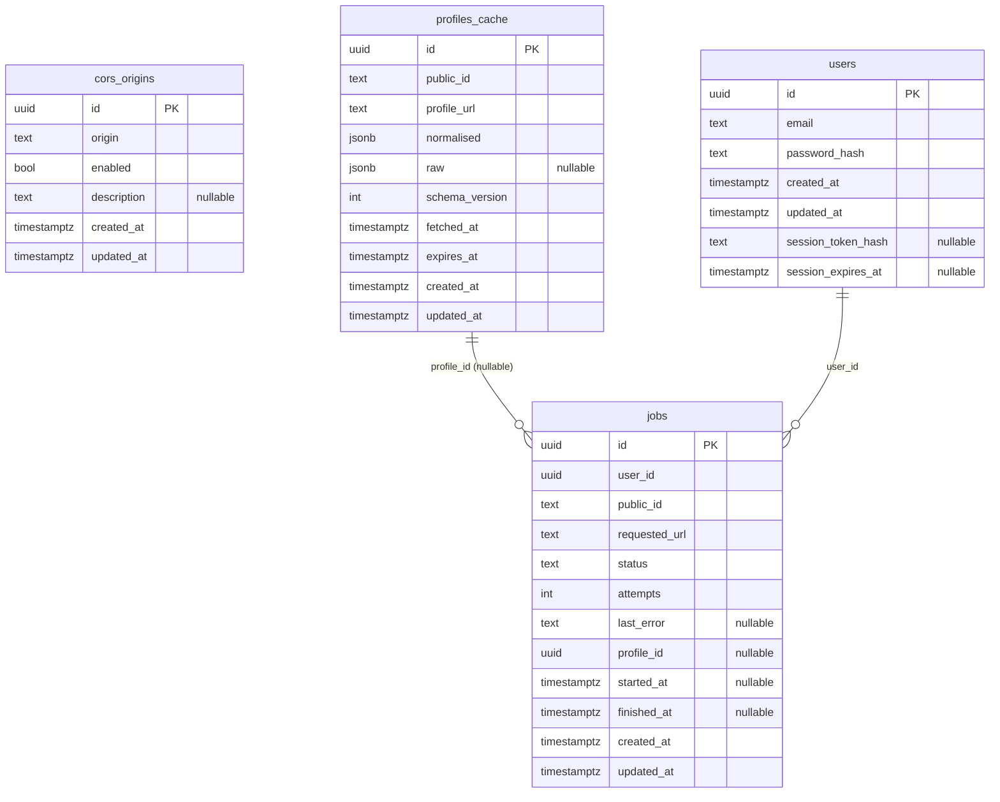

# Database schema

Source of truth is `api/migrations/*.sql`. This document is **generated from the
live database** (`pnpm --dir api db:erd`) so it cannot silently drift from what
is actually deployed.



## Notes

- **`users`** — email is unique case-insensitively (`users_email_lower_key` on
  `lower(email)`). `password_hash` is scrypt: `scrypt$N$r$p$salt$hash`.
- **`sessions`** — `token_hash` is the SHA-256 of the bearer token; the token
  itself is never stored. A session is live while `revoked_at IS NULL AND
  expires_at > now()`. Logout sets `revoked_at`.
- **`profiles_cache`** — shared across users, one row per `public_id`. `raw`
  keeps the untouched upstream payload so a corrected normaliser can re-run
  without refetching; `schema_version` records which normaliser produced
  `normalised`.
- **`jobs`** — one row per submission, and doubles as per-user search history
  (`jobs_user_created_idx` on `user_id, created_at DESC`). Claimed by the worker
  with `FOR UPDATE SKIP LOCKED` via `jobs_claim_idx`. `profile_id` is
  `ON DELETE SET NULL` so evicting a cache row does not delete history.
- Two users searching the same profile each get their own `jobs` row; duplicate
  fetch work is prevented at runtime by a `pg_advisory_xact_lock` on
  `public_id`, not by a unique constraint.

## Regenerating

```bash
cd api && pnpm db:erd
```
